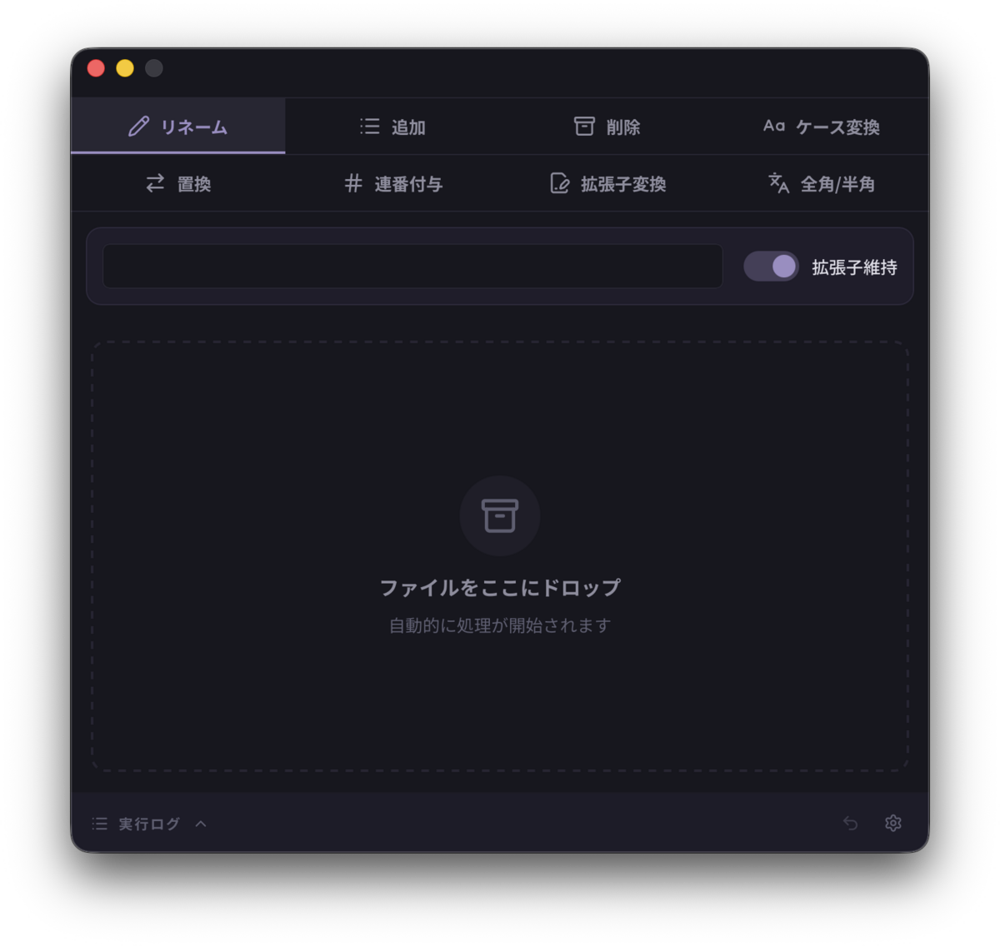

# DDRenamer

*[English](README.md)*

Rust と Tauri で作ったバッチリネームツールです。タブで機能を選び、大きなドロップゾーンに投げ込むだけでリネームが終わります。**迷わない、広い、速い** —— そして**取り消せる**。



## ダウンロード

ビルド済みバイナリは [releases](https://github.com/takakix2/ddrenamer/releases) にあります。

| OS | ファイル | 備考 |
|---|---|---|
| macOS | `DDRenamer_*_universal.dmg` | Intel / Apple Silicon 両対応。**署名 + notarize 済み**なのでそのまま開けます（オフラインでも） |
| Windows | `DDRenamer_*_x64-setup.exe` | インストーラ（推奨） |
| Windows | `DDRenamer_*_x64_en-US.msi` | MSI |
| Linux | `DDRenamer_*_amd64.deb` | Debian / Ubuntu |
| Linux | `DDRenamer-*.x86_64.rpm` | Fedora / RHEL |
| Linux | `DDRenamer_*_amd64.AppImage` | どのディストリでも。WebKitGTK を丸ごと抱えるので大きいです |

🔴 **Windows 版は署名していません。** SmartScreen が「Windows によって PC が保護されました」を出しますが、**証明書が無いというだけでマルウェア判定ではありません**。「詳細情報」→「実行」で進めるか、ソースからビルドしてください。

## 🌟 特徴

- **🚀 爆速リネーム**: Rust (`std::fs`) によるOSネイティブな高速ファイル操作。
- **🛡️ 安全設計**: 
  - 実行結果をサイドバーログでリアルタイム表示。
  - 同名ファイル存在チェック、空名バリデーション搭載。
  - **拡張子保護**: 文字変換時に誤って拡張子を書き換えないスマート・トリートメント機能。
- **🎨 モダンUI**: 
  - **Tauri v2** + React + **Lethe UI Kit** による洗練されたインターフェース。
  - Tabula / Alethoglyph と**同じデザインシステム・同じ同梱フォント**で見た目を揃えたファミリー。
  - 直感的なフラットデザインとスムーズな操作性。
  - ダークモード標準搭載（Kit の `data-theme` で Lethe / Dark / Light / Cyber を持つ）。
- **📋 柔軟なファイル入力**:
  - **ドラッグ＆ドロップ**: ファイルマネージャーから直接ドロップ。
  - **クリップボードペースト** (`Ctrl+V`): コピーしたファイルを貼り付けて即リネーム。
  - **Alethoglyph 連携**: Alethoglyph で検索 → `Ctrl+C` → DDRenamer で `Ctrl+V` のシームレスなワークフロー。
- **Cross-Platform**: Windows, macOS, Linux 対応。

## 🛠 機能一覧

タブ切り替えにより、以下の高度なリネーム操作を直感的に行えます。

### 1. リネーム (Rename)
- 全ファイルを指定した名前に統一。
- 拡張子の維持/破棄を選択可能。

### 2. 追加 (Add)
- **Add**: 先頭または末尾に文字列を追加（拡張子を跨がない安全設計）。

### 3. 削除 (Trim)
- **Trim**: 先頭または末尾からN文字を削除。

### 4. 置換 (Replace)
- **Replace**: 文字列置換 (**正規表現 Regex 対応**)。

### 5. 連番 (Serial)
- **Advanced Serial**: 接頭辞 (Prefix) + 連番 + 接尾辞 (Suffix)。
- **Keep Original**: 元のファイル名を残したまま連番を付与可能 (`Vacation_001.jpg` 等)。
- **Manual Increment**: ファイルを1つずつドロップするたびにカウントアップする「手動連番」モード搭載。
- **Padding Control**: 桁数（0埋め）を自在に指定。

### 6. ケース変換 (Case)
- 大文字/小文字変換 (UPPERCASE / lowercase)。**Stem のみに適用**。
- `IMG_001.JPG` → 小文字 → `img_001.JPG`（**`.JPG` は大文字のまま**）。
  拡張子の大小を変えるのは次の「拡張子変換」の仕事です。

### 7. 全角/半角 (Width)
- 全角/半角変換 (ＡＢＣ ↔ ABC・全角スペース U+3000 ↔ 半角スペース)。**Stem のみに適用**。
- 仮名・漢字は両方向とも変換しません（半角相当を持たないため）。

### 8. 拡張子変換 (Extension)
- 拡張子の一括変更。ドットの有無は問いません。空にすると拡張子を外します。

---

## 🚫 作れない名前

**この道具は、どの OS で動いていても Windows の規則で名前を検査します。**
Linux で作った名前が Windows で開けない、という壊れ方は**ファイルが機械を渡った後**に
初めて表面化し、原因のリネームから遠く離れた所で起きます。それを避けるための方針で、
代償として **Linux では合法な `a:b.txt` がこの道具では作れません**。

| 弾くもの | 例 |
|---|---|
| 禁止文字 `< > : " / \ \| ? *` | `a:b.txt` / `a/b.jpg` |
| 制御文字 | — |
| 末尾のドット・空白 | `photo.` / `photo ` |
| 予約デバイス名（大小問わず） | `CON` `PRN` `AUX` `NUL` `COM1`〜`COM9` `LPT1`〜`LPT9`、および `CON.txt` のように拡張子が付いたもの |
| 空の名前 | 変換結果が空 / 空白だけ |

弾かれたファイルは**名前が変わりません**。ログに 1 件 1 行で理由が出ます
（`Invalid character '/'` / `Reserved name 'CON'` など）。

### 📌 予約デバイス名について — **今の Windows より厳しくしています**

2026-08-19 に Windows 11 (build 26200) で実測したところ:

- **`CON.txt` は普通のファイルでした。** 作成でき、`type` / `copy` / `del` も通ります
- **裸の `CON` は今も装置です。** ディスク上にファイルとして作ることはできてしまいますが、
  その後 `type CON` はコンソールを読みに行き、**そのファイルには二度と届きません**

つまり `CON.txt` を弾くのは**今の Windows の制約ではなく、この道具の判断**です。
古い Windows では `CON.txt` も装置に解決され、Microsoft のドキュメントも今なお
この形の名前を避けるよう書いています。ファイルは機械とネットワーク共有を渡るので、
**目の前の OS が許すかどうかではなく、渡った先で開けるかどうか**で決めています。

⚠️ この結果、**全角の `ＣＯＮ.txt` を半角化することはできません**（`CON.txt` になるため）。
今の Windows では成功しうる操作を、意図的に諦めています。

## 📦 ビルドとインストール

### 前提条件
- [Bun](https://bun.sh/)
- Rust (Cargo)
- **`Lethe_UI_Kit` は自動で用意されます** — `bun install` の `postinstall` が `src/ui-kit` を
  作ります。隣に checkout があれば symlink し、無ければ公開ミラーを clone するので、
  **リポジトリ単体の clone でもビルドできます**（2026-08-19 に Windows で実証）。
  ⚠️ Windows で隣に checkout を置くと symlink の作成に開発者モードか管理者権限が要ります。
  置かなければ clone 側の経路になるので、そちらが無難です。
- Linux でバンドル (`deb`/`rpm`/`AppImage`) を焼くなら `libayatana-appindicator3-dev`
  （実体の `.so` ではなく **`.pc` が必要**。ビルドするマシンにだけ要る）

> パッケージマネージャは **bun に一本化**しています（`bun.lock` が正）。
> m4air には node が入っていないため、npm を正にすると別マシンでビルドできません。

### 開発モード起動
```bash
bun install
bun run tauri dev
```

### リリースビルド
```bash
bun run tauri build
```
生成されたバイナリ (`src-tauri/target/release/bundle/`) を使用してください。

## ⚠️ Known Issues / Notes
- **入力欄の `Ctrl+Z`**: Linux では WebKitGTK にキーバインドが無いため、アプリ側で
  editing command に繋いでいます。**戻す粒度は WebKit が決める**ので、一気に打った名前は
  一度で全部消えることがあります（`Ctrl+Shift+Z` で戻せます）。
- **置けない名前**: 上の「[作れない名前](#-作れない名前)」を参照。移植性のため、
  **どの OS でも Windows の規則で弾きます**。

> 📌 以前ここには「Wayland では D&D が動作しない場合がある」と書いてありましたが、
> **2026-07-30 に GNOME Wayland ネイティブで実機確認したところ D&D も `Ctrl+V` も動きます。**
> 一度も測られないまま運ばれていた記述でした。

## 📜 ライセンス

**MIT License** — 全文は [`LICENSE`](LICENSE)。

⚠️ 配布物には**同梱フォント (SIL Open Font License 1.1)** をはじめとする第三者コンポーネントが
含まれます。それらの表記は [`THIRD-PARTY-NOTICES.md`](THIRD-PARTY-NOTICES.md) に集約しており、
**バイナリを配るときは一緒に配る必要があります**（OFL の要求）。

## 🌱 着想について

「ドロップゾーンに投げ込むだけでリネームが終わる」という発想は、soft.NU の
**[Drag&Drop Renamer](http://nu.way-nifty.com/top/dragdrop_renamer/index.html)** に由来します。

⚠️ **本アプリは同作の移植でも後継でもありません。** 名前も異なり、実装・UI・機能は独自のものです
（Tauri v2 + Rust による作り直しで、Undo / i18n / テーマ / 正規表現置換 などは本アプリ固有）。
着想を得た先として敬意を込めて記載しています。
