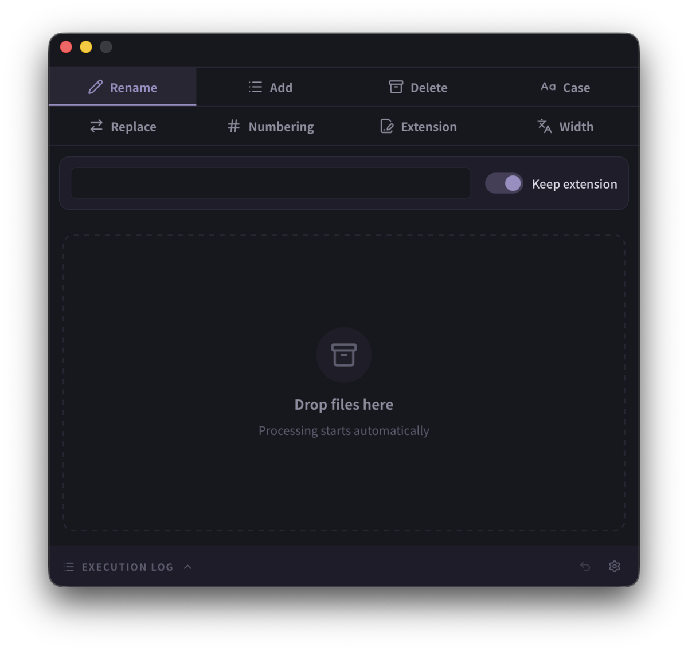

# DDRenamer

*[日本語版はこちら](README.ja.md)*

A batch file renamer built with Rust and Tauri. Pick a mode with a tab, drop files onto a large target, and the rename is done. **Nothing to navigate, room to aim, and fast** — and it can be undone.



## Download

Prebuilt binaries are on the [releases page](https://github.com/takakix2/ddrenamer/releases).

| OS | File | Notes |
|---|---|---|
| macOS | `DDRenamer_*_universal.dmg` | Intel and Apple Silicon. Signed and notarized, so it opens without ceremony — including offline |
| Windows | `DDRenamer_*_x64-setup.exe` | Installer (recommended) |
| Windows | `DDRenamer_*_x64_en-US.msi` | MSI |
| Linux | `DDRenamer_*_amd64.deb` | Debian / Ubuntu |
| Linux | `DDRenamer-*.x86_64.rpm` | Fedora / RHEL |
| Linux | `DDRenamer_*_amd64.AppImage` | Any distribution. Large, because it carries WebKitGTK |

**The Windows builds are not code-signed.** SmartScreen will show its blue "Windows protected your PC" screen. That is the absence of a certificate, not a malware verdict — choose **More info → Run anyway**, or build from source if you would rather not take my word for it.

## What it does

Eight tabs: **Rename · Add · Delete · Case · Replace · Numbering · Extension · Width**.

- **Rename** — give every file the same name; keep or drop the extension
- **Add** — text at the start or the end, without crossing into the extension
- **Delete** — N characters off the front or the back
- **Replace** — literal or **regular expression**
- **Numbering** — prefix, counter, suffix; keep the original name (`Vacation_001.jpg`); pad to a width; or count up one drop at a time
- **Case** — UPPERCASE / lowercase, **stem only**. `IMG_001.JPG` lowercased is `img_001.JPG`; changing `.JPG` is the Extension tab's job
- **Extension** — change or remove it, with or without the dot
- **Width** — full-width ↔ half-width for letters, digits and the ideographic space (ＡＢＣ ↔ ABC, U+3000 ↔ space), **stem only**. Kana and kanji are left alone, having no half-width counterpart here

Also:

- **Undo** (`Ctrl+Z` / `⌘Z`) — one drop is one batch, and the last 20 batches can be walked back. Held in memory only, so it is not a substitute for a backup
- **Paste files** (`Ctrl+V`) as well as dropping them
- **Japanese and English**, four themes
- **Runs entirely offline.** No network calls, fonts included in the binary

## Renaming is refused rather than risked

A rename onto an existing file is **refused, never silently overwritten**. Renames that change only case are allowed, because identity is decided by asking the filesystem (inode on Unix, file index on Windows) rather than by comparing the two names — on a case-insensitive volume the target "already exists" precisely because it *is* the file being renamed.

## Names it will not create

**The Windows rules are applied on every platform, including Linux and macOS.**

A name that Linux accepts and Windows cannot open breaks *after* the file has crossed to another machine or a share, far from the rename that caused it. Applying the strictest rules everywhere trades a little freedom for names that keep working wherever they end up. The price is that `a:b.txt`, legal on Linux, cannot be produced here.

| Refused | Example |
|---|---|
| Characters `< > : " / \ \| ? *` | `a:b.txt`, `a/b.jpg` |
| Control characters | — |
| A trailing dot or space | `photo.`, `photo ` |
| Reserved device names, any case | `CON` `PRN` `AUX` `NUL` `COM1`–`COM9` `LPT1`–`LPT9`, and forms with an extension such as `CON.txt` |
| An empty name | the result is empty or only whitespace |

A refused file **keeps its name**, and the log says why, one line per file (`Invalid character '/'`, `Reserved name 'CON'`).

### On device names — this is stricter than the Windows in front of you

Measured on Windows 11 build 26200 (2026-08-19):

- **`CON.txt` is an ordinary file.** It can be created, and `type`, `copy` and `del` all reach it
- **A bare `CON` is still a device.** It *can* be put on disk, and then nothing can open it again — `type CON` reads the console instead

So refusing `CON.txt` is this tool's decision, not the operating system's. Older Windows resolved that form to the device, and Microsoft still documents it as one to avoid. Files travel, so the question worth answering is not whether the OS in front of you accepts the name, but whether the name still opens where the file ends up.

The cost lands on width conversion: **`ＣＯＮ.txt` cannot be narrowed**, because it would become `CON.txt`. An operation that would succeed on today's Windows is given up on purpose.

## Building

### Requirements
- [Bun](https://bun.sh/)
- Rust (Cargo)
- Linux, for `deb`/`rpm`/`AppImage`: `libayatana-appindicator3-dev` (the `.pc` file is what is needed, not just the `.so`, and only on the machine doing the building)

`bun install` puts the shared design system in place through `postinstall` — it symlinks a sibling checkout if one exists and clones the public mirror otherwise, so **a bare clone of this repository builds**. On Windows, prefer *not* having a sibling checkout: creating the symlink there needs Developer Mode or an elevated shell, while the clone path needs neither.

> Bun is the only package manager here; `bun.lock` is authoritative.

```bash
bun install
bun run tauri dev      # development
bun run tauri build    # release bundles land in src-tauri/target/release/bundle/
```

## Known issues

- **`Ctrl+Z` inside a text field on Linux.** WebKitGTK has no binding for it, so the app wires the key to the editing command instead. **WebKit decides the granularity**, which means a name typed in one burst can vanish in one undo (`Ctrl+Shift+Z` brings it back).

## License

**MIT** — see [`LICENSE`](LICENSE).

Distributed builds include third-party components, notably the **bundled fonts under the SIL Open Font License 1.1**. Their notices are collected in [`THIRD-PARTY-NOTICES.md`](THIRD-PARTY-NOTICES.md), and **that file has to travel with the binary** — the OFL requires it. Every published artifact carries it.

## Where the idea came from

The shape of this tool — a drop target big enough that dropping *is* the whole interaction — comes from soft.NU's **[Drag&Drop Renamer](http://nu.way-nifty.com/top/dragdrop_renamer/index.html)**.

⚠️ **This is not a port of it, and not a successor to it.** The name differs, and the implementation, interface and feature set are their own: a rebuild on Tauri v2 and Rust, with undo, localisation, themes and regular-expression replacement particular to this one. The credit is offered as acknowledgement of where the idea started.
